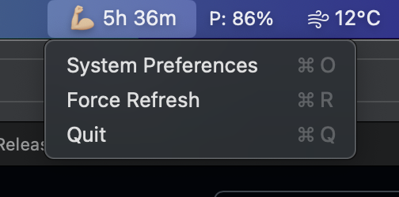
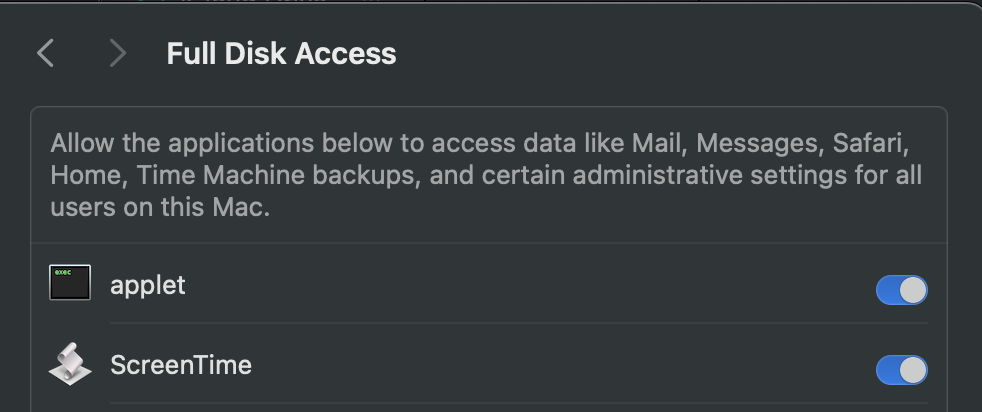

# screentime

A MacOS status bar item to show today's screen time for roughly tracking work hours.



This is pretty much just an alternative display to `System Preferencs/Screen Time`.
Uses macOS "Knowledge" SQLite database to find total app usage and displays in status bar with format of `##h ##m`.
Also, built without using xcode editor and only uses Swift Package Manager (SPM).

Tested on MacBook Pro M1 with macOS 12.6

## Commands

```sh
# build
swift build

# run
swift run
```

## Run on Startup

```applescript
# screentime.applescript
do shell script "swift run --package-path $PATH_TO_REPO"
```

```sh
# compile AppleScript command to macOS app
osacompile -o ScreenTime.app screentime.applescript
```

Go to `System Preferences > Users & Groups > Login Items`, then press `+` and add `ScreenTime.app`.

## Full Disk Access
Full Disk Access wasn’t always required to read the Screen Time (and related) databases on macOS. However, starting with macOS Catalina (10.15), Apple restricted access to these files. If you don’t grant Full Disk Access to both Applet (automatically listed when the app runs) and ScreenTime.app, you’ll encounter the “authorization denied (code: 23)” error. To avoid this, go to System Settings → Privacy & Security → Full Disk Access, and make sure both are enabled.



## References

- https://www.swiftbysundell.com/articles/building-a-command-line-tool-using-the-swift-package-manager/
- https://www.mac4n6.com/blog/2018/8/5/knowledge-is-power-using-the-knowledgecdb-database-on-macos-and-ios-to-determine-precise-user-and-application-usage
- https://github.com/stephencelis/SQLite.swift
